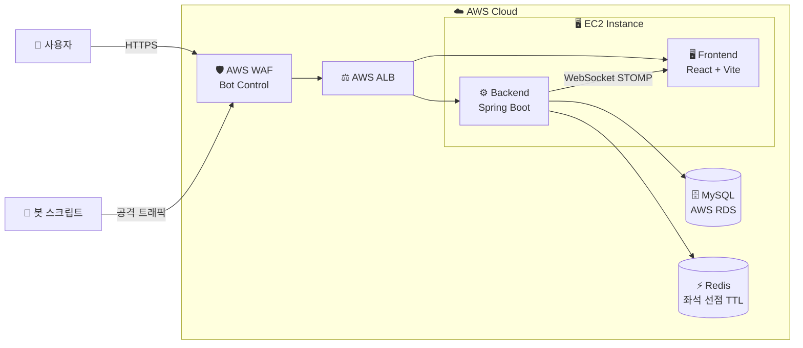

<div align="center">

# ⚾ KBO 야구 티켓팅 플랫폼
### AWS WAF Bot Control 기술 검증 프로젝트

**MSP Architect Training 2026 · Team 05**

---


---

> 🔴 **핵심 목표**: AWS WAF Bot Control 단독 도입 가능성 실증
> 야구 티켓 예매 모의 플랫폼을 배경으로 **봇 탐지율(TPR) / 오탐율(FPR)** 을 정량 측정합니다.

</div>

---

## 👥 팀원

| 역할 | 이름 | 주요 담당 | GitHub |
|------|------|-----------|--------|
| 팀장 |  | 인프라 · AWS WAF · EC2 · ALB | @ |
| 팀원 |  | Backend · DB · Redis · WebSocket | @ |
| 팀원 |  | Frontend · UX · React | @ |

---

## 🎯 프로젝트 목표

- AWS WAF Bot Control **단독** 도입 시 봇 트래픽 탐지율(TPR) 측정
- 정상 사용자 오탐율(FPR) 측정 및 임계값 분석
- Redis 분산락 기반 좌석 선점으로 **동시성 제어** 구현
- WebSocket STOMP 실시간 좌석 상태 업데이트 구현

---

## 🏗️ 시스템 아키텍처



> 📖 상세 아키텍처는 [Wiki — 시스템 아키텍처](../../wiki/10-시스템-아키텍처) 참조

---

## 🛠️ 기술 스택

| 계층 | 기술 |
|------|------|
| **Frontend** | React 19, TypeScript, Vite, TailwindCSS, STOMP WebSocket, SockJS |
| **Backend** | Spring Boot 3.2, Java 17, Spring Security, JWT, JPA, Swagger |
| **Database** | MySQL 8.0 (AWS RDS), H2 (로컬 개발) |
| **Cache** | Redis — 좌석 선점 분산락 5분 TTL |
| **Infra** | AWS EC2, AWS RDS, AWS WAF Bot Control, AWS ALB |
| **CI/CD** | GitHub Actions, ArgoCD GitOps |
| **Monitoring** | AWS CloudWatch, Prometheus, Grafana, Loki |
| **Load Test** | K6, HPA |

---

## 📡 핵심 API

| 도메인 | Method | URI | 설명 |
|--------|--------|-----|------|
| 경기 | `GET` | `/api/games` | 날짜/팀 필터 + 페이지네이션 |
| 경기 | `GET` | `/api/games/{gameId}` | 구역별 잔여 좌석 포함 |
| 좌석 | `GET` | `/api/games/{gameId}/seats` | 실시간 좌석 상태 반환 |
| **좌석** | **`POST`** | **`/api/games/{gameId}/seats/lock`** | **🔴 Redis 분산락 5분 TTL — WAF 검증 핵심** |
| WebSocket | `WS` | `/ws/seats` (STOMP) | 실시간 좌석 상태 브로드캐스트 |
| 대기열 | `POST` | `/api/queue/enter` | 순번 토큰 발급 |
| 대기열 | `GET` | `/api/queue/status/{token}` | 순번/대기시간 반환 |
| 대기열 | `DELETE` | `/api/queue/exit/{token}` | 대기열 이탈 |

---

## 🔑 핵심 구현 포인트

### ⚡ Redis 분산락 기반 좌석 선점

```
동시에 N명이 같은 좌석 클릭
        ↓
Redis SETNX — 원자적 처리
        ↓
✅ 1명만 성공 → lockToken 발급 (5분 TTL)
❌ 나머지    → SEAT_ALREADY_LOCKED (409)
```

> **WAF Bot Control 검증 시나리오**
> 봇 스크립트로 `/seats/lock` 대량 호출 → WAF 차단율(TPR) 측정
> 정상 사용자 오탐율(FPR) 동시 측정

### 📡 WebSocket 실시간 좌석 상태

```
사용자 A 좌석 선점
        ↓
SeatService → SimpMessagingTemplate.convertAndSend
        ↓
/topic/seats/{gameId} 구독 중인 모든 사용자에게 LOCKED 상태 전파
```

---

## 🚀 빠른 시작

### 사전 요구사항

- Java 17+
- Node.js 20+
- Redis (Memurai 또는 redis-server)
- MySQL 8.0 또는 H2 (로컬 개발)

### 로컬 실행 (H2 + Redis)

```bash
git clone https://github.com/Team-msp-architect-2026/msp-team05.git
cd msp-team05

# 백엔드 실행
cd Backend
./gradlew bootRun

# 프론트엔드 실행 (새 터미널)
cd ../Frontend
npm install
npm run dev
```

| 서비스 | URL |
|--------|-----|
| 프론트엔드 | http://localhost:5173 |
| Swagger UI | http://localhost:8080/swagger-ui/index.html |
| H2 콘솔 | http://localhost:8080/h2-console |

### AWS 배포 (EC2 + RDS)

```bash
# application.yml → MySQL RDS 설정으로 변경 후
./gradlew clean build -x test
nohup java -jar build/libs/ticket-0.0.1-SNAPSHOT.jar &
```

---

## 📂 디렉토리 구조

```
.
├── .github/             # Issue/PR 템플릿
├── docs/                # 설계 문서 (ADR 등)
├── k8s/                 # Kubernetes 매니페스트
├── helm/                # Helm Chart
├── Frontend/            # React + TypeScript
│   ├── src/
│   │   ├── api/         # axios 인스턴스, API 함수
│   │   ├── pages/       # 페이지 컴포넌트
│   │   └── components/  # 공통 컴포넌트
│   └── package.json
└── Backend/             # Spring Boot
    └── src/main/java/com/baseball/ticket/
        ├── config/      # Security, CORS, Redis, WebSocket, Swagger
        ├── global/      # 공통 응답, 예외, JWT
        └── domain/
            ├── game/    # 경기 API
            ├── seat/    # 좌석 API (Redis 분산락)
            ├── queue/   # 대기열 API
            └── auth/    # 인증 (JWT)
```

---

## 📚 문서

| 문서 | 위치 |
|------|------|
| 요구사항 정의서 | [Wiki](../../wiki/01-요구사항-정의서) |
| 시스템 아키텍처 | [Wiki](../../wiki/10-시스템-아키텍처) |
| API 명세서 | [Wiki](../../wiki/30-API-명세서) |
| ERD | [Wiki](../../wiki/40-ERD) |
| Runbook | [Wiki](../../wiki/50-인프라-Runbook) |
| WAF 실험 결과 | [Wiki](../../wiki/60-WAF-실험-결과) |
| ADR | [docs/adr/](docs/adr/) |

---

## 🤝 기여 방법

[CONTRIBUTING.md](CONTRIBUTING.md) 참조

---

## 📄 라이선스

[MIT](LICENSE)

---

<div align="center">

**Made with ❤️ by MSP Team 05**

</div>


<!--

# MSP Team05 — 프로젝트명

> MSP Architect Training 2026 · MSP Team05 ([팀원 이름들])

한 줄 프로젝트 소개를 여기에. (예: "K8s 기반 OO 서비스를 GitOps로 운영하는 플랫폼")

## 👥 팀원

| 역할 | 이름 | 주요 담당 | GitHub |
|------|------|-----------|--------|
| 팀장 |  | 인프라 · ArgoCD | @ |
| 팀원 |  | Backend · DB | @ |
| 팀원 |  | Frontend · UX | @ |

## 🎯 프로젝트 목표

-
-
-

## 🏗️ 시스템 아키텍처

```mermaid
flowchart LR
    User[사용자] --\>|HTTPS| Ingress[Nginx Ingress]
    Ingress --\> FE[Frontend]
    Ingress --\> BE[Backend API]
    BE --\> DB[(MySQL)]
    BE --\> AI[AI Service]
    subgraph K8s[k3s Cluster]
        FE
        BE
        AI
        DB
    end
```

> 📖 상세 아키텍처는 [Wiki — 시스템 아키텍처](../../wiki/10-시스템-아키텍처) 참조

## 🛠️ 기술 스택

| 계층 | 기술 |
|------|------|
| Frontend |  |
| Backend |  |
| Database |  |
| Infra | k3s, Helm, ArgoCD |
| CI/CD | GitHub Actions, ArgoCD |
| Monitoring | Prometheus, Grafana, Loki |

## 🚀 빠른 시작

### 사전 요구사항
- Docker / Docker Compose
- kubectl, helm
- (기타)

### 로컬 실행
```bash
git clone git@github.com:Team-msp-architect-2026/msp-team05.git
cd msp-team05
cp .env.example .env
docker compose up -d
# http://localhost:3000
```

### K8s 배포 (ArgoCD)
```bash
kubectl apply -f k8s/argocd/application.yaml
```

## 📂 디렉토리 구조

```
.
├── .github/             # Issue/PR 템플릿, CODEOWNERS
├── docs/                # 설계 문서 (ADR 등)
├── k8s/                 # Kubernetes 매니페스트
├── helm/                # Helm Chart
├── frontend/            # 프론트엔드
├── backend/             # 백엔드 API
└── README.md
```

## 📚 문서

| 문서 | 위치 |
|------|------|
| 요구사항 정의서 | [Wiki](../../wiki/01-요구사항-정의서) |
| 시스템 아키텍처 | [Wiki](../../wiki/10-시스템-아키텍처) |
| API 명세서 | [Wiki](../../wiki/30-API-명세서) |
| ERD | [Wiki](../../wiki/40-ERD) |
| Runbook | [Wiki](../../wiki/50-인프라-Runbook) |
| ADR | [docs/adr/](docs/adr/) |

## 🤝 기여 방법

[CONTRIBUTING.md](CONTRIBUTING.md) 참조

## 📄 라이선스

[MIT](LICENSE)


-->
